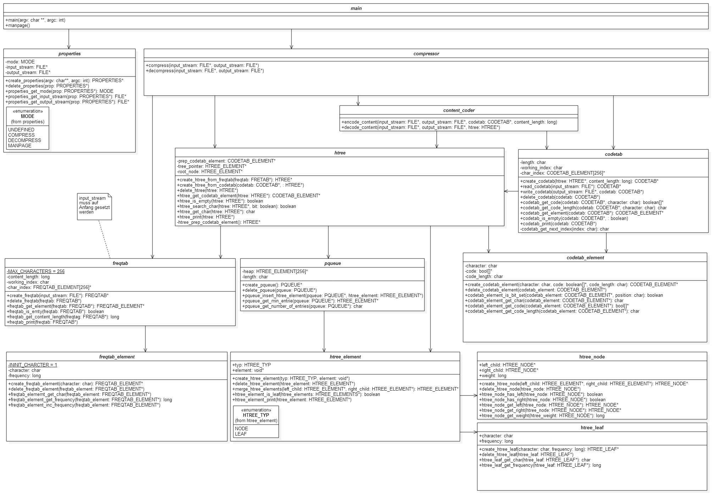
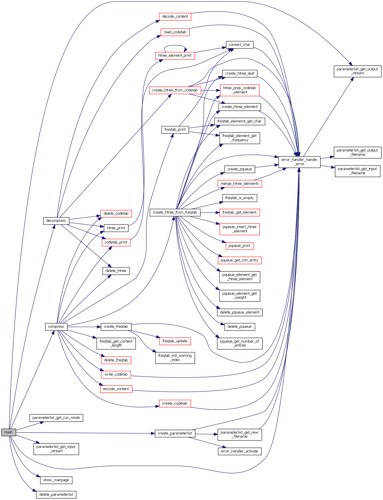

CompressIt
==========
CompressIt ist eine Software, die auf Basis der Huffman-Kodierung Dateien komprimieren und dekomprimieren kann.

Modulübersicht
--------------

Funktionsabhängigkeiten
-----------------------

Komprimierung
-------------

Dekomprimierung
---------------

